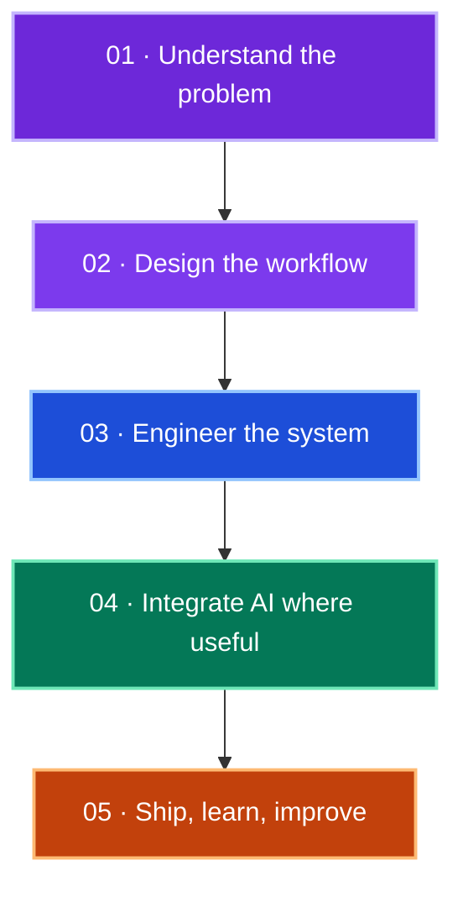

<h1>Reshika Srivastava</h1>

<strong>PRODUCT AI LEAD&nbsp; × &nbsp;SOFTWARE ENGINEER</strong> 
AI PRODUCT BUILDER

<em>From product questions to software people can actually use.</em>

🟣 PRODUCT &nbsp;→&nbsp; 🔵 AI &nbsp;→&nbsp; 🟢 ENGINEERING &nbsp;→&nbsp; 🟠 SHIP

  <a href="https://www.linkedin.com/in/reshikasrivastava/">LinkedIn</a>
  &nbsp;·&nbsp;
  <a href="mailto:reshika2354@gmail.com">Email</a>
  &nbsp;·&nbsp;
  <a href="https://github.com/Reshika0504">GitHub</a>

> [!IMPORTANT]
> **Currently building at I Am Still Alive:** healthcare product experiences where product decisions, AI-enabled workflows, backend engineering, and thoughtful interfaces meet.

## 01 / Professional · Production Experience

| 🟣 I AM STILL ALIVE · HEALTHCARE PRODUCT |
| :--- |
| **Product AI Lead** at a US-based healthcare and oncology startup. I work from product requirements and architecture through implementation, building patient, clinician, and community experiences.    My work includes Ask-the-Doctor and Virtual Tumor Board workflows, role-based access, AI-enabled experiences, content moderation, and responsive product features.    **Engineering:** Python · Django · Django REST Framework · REST APIs · WebSockets / Django Channels · Celery |

| 🔵 INTERNAL MANAGEMENT PORTAL · NEXT.JS |
| :--- |
| I contribute to an existing **Next.js** portal that connects employee, HR, and leadership workflows. It brings together employee records and reporting lines, attendance, daily updates and tasks, meetings and decisions, announcements, documents and policies, and Microsoft 365 / Teams calendar coordination.    My contribution spans role-aware experiences, product workflows, and server-enforced permissions. |

Professional work is summarized here; company code is not presented as a public project.

## 02 / Selected Public Work

| 🟠 01 · SPENDWISE |
| :--- |
| A full-stack personal expense platform for tracking transactions, exploring category-level spending, and understanding monthly patterns.    **Built with** React · Node.js · Express.js · MongoDB · JWT    [View code →](https://github.com/Reshika0504/Expense_Management_System) &nbsp;·&nbsp; [Open live demo →](https://expense-management-system-frontend-3o3i.onrender.com/) |

| 🟣 02 · MULTI-TENANT SAAS CRM |
| :--- |
| A tenant-scoped CRM workspace for leads, contacts, and deals, with role-based access and audit tracking.    **Built with** React · Node.js · Express.js · MongoDB · JWT    [View code →](https://github.com/Reshika0504/Salesforce_mini) &nbsp;·&nbsp; [Open live demo →](https://salesforce-mini-frontend.onrender.com/) |

| 🔵 03 · NOTION-LIKE AI DOCUMENT EDITOR |
| :--- |
| A block-based writing canvas with drag-and-drop organization, local draft persistence, and AI writing actions.    **Built with** React · TypeScript · Zustand · Vite    [View code →](https://github.com/Reshika0504/Notion-Like-AI-Document-Editor) &nbsp;·&nbsp; [Open live demo →](https://notion-like-ai-document-editor.vercel.app/) |

| 🟢 04 · ANOMALY DETECTION IN SURVEILLANCE VIDEOS |
| :--- |
| A video-classification project that combines MobileNetV2 spatial features with temporal sequence modeling and a Flask upload interface.    **Built with** Python · TensorFlow / Keras · MobileNetV2 · LSTM · OpenCV · Flask    [View code and local run instructions →](https://github.com/Reshika0504/Anomaly_Detection_System) |

## 03 / Engineering Palette

| Focus | Tools and systems |
| :--- | :--- |
| 🟣 **Product & web** | Next.js · React · TypeScript · JavaScript · Tailwind CSS |
| 🔵 **Backend & workflows** | Python · Django / DRF · Node.js / Express · REST APIs · WebSockets / Django Channels · Celery |
| 🟢 **Data & AI** | PostgreSQL · MongoDB · Redis · TensorFlow / Keras · OpenCV · AI integrations |
| 🟠 **Delivery** | Git · GitHub Actions · authentication · role-based access |

## 04 / How I Build

I start with the workflow and use AI where it helps the product, then carry the idea through engineering and release.

---

<strong>Have a product problem that needs both AI thinking and solid engineering?</strong> 
<a href="mailto:reshika2354@gmail.com">Let's connect →</a>

