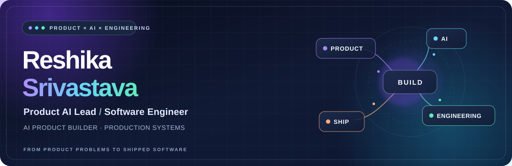
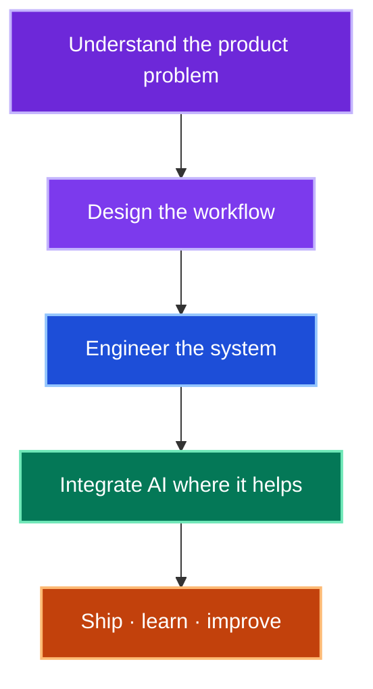

  <strong>Reshika Srivastava</strong> · Product AI Lead · Software Engineer · AI Product Builder 
  From product problems to production systems.

  <a href="https://www.linkedin.com/in/reshikasrivastava/">LinkedIn</a>
  &nbsp;·&nbsp;
  <a href="mailto:reshika2354@gmail.com">Email</a>
  &nbsp;·&nbsp;
  <a href="https://github.com/Reshika0504">GitHub</a>

  <code>Product thinking</code> &nbsp; <code>AI workflows</code> &nbsp;
  <code>Backend systems</code> &nbsp; <code>Full-stack delivery</code>

---

## 01 / Building in Production

I work at the intersection of product direction and implementation, turning healthcare workflows into usable software.

| 🟣 **I Am Still Alive** · Product AI Lead |
| :--- |
| **Product:** Patient, clinician, and community experiences at a US-based healthcare and oncology startup, including Ask-the-Doctor and Virtual Tumor Board workflows. **Engineering:** Django / DRF APIs, role-based access, WebSockets / Django Channels, Celery, AI-enabled workflows, and content moderation. |

| 🔵 **Internal Management Portal** · Next.js |
| :--- |
| I contribute to an existing **Next.js** portal connecting employee, HR, and leadership workflows: people records, reporting lines, attendance, tasks, meeting decisions, announcements, policies, and Microsoft 365 / Teams calendar coordination. **Focus:** Role-aware UX, product architecture, and server-enforced permissions. |

Professional work is summarized without sharing private company code.

## 02 / Featured Projects

Product and engineering projects with code you can explore; live links are included where available.

| 🟠 **Spendwise** · Personal finance product |
| :--- |
| Track expenses, understand category spending, and review monthly patterns through a responsive full-stack application. **Stack:** React · Node.js · Express.js · MongoDB · JWT [Repository →](https://github.com/Reshika0504/Expense_Management_System) &nbsp;·&nbsp; [Live demo →](https://expense-management-system-frontend-3o3i.onrender.com/) |

| 🟣 **Multi-Tenant SaaS CRM** · Product architecture |
| :--- |
| A tenant-scoped workspace for leads, contacts, and deals, with role-based access and audit tracking. **Stack:** React · Node.js · Express.js · MongoDB · JWT [Repository →](https://github.com/Reshika0504/Salesforce_mini) &nbsp;·&nbsp; [Live demo →](https://salesforce-mini-frontend.onrender.com/) |

| 🔵 **Notion-Like AI Document Editor** · AI product experience |
| :--- |
| A block-based writing canvas with drag-and-drop organization, local draft persistence, and AI writing actions. **Stack:** React · TypeScript · Zustand · Vite [Repository →](https://github.com/Reshika0504/Notion-Like-AI-Document-Editor) &nbsp;·&nbsp; [Live demo →](https://notion-like-ai-document-editor.vercel.app/) |

| 🟢 **Anomaly Detection in Surveillance Videos** · Computer vision |
| :--- |
| Video classification using MobileNetV2 spatial features and temporal sequence modeling, with a Flask upload interface. **Stack:** Python · TensorFlow / Keras · OpenCV · Flask [Repository and local run instructions →](https://github.com/Reshika0504/Anomaly_Detection_System) |

<strong>More engineering work</strong>

 

- [AI Research Copilot](https://github.com/Reshika0504/AI_Research_Copilot) — document retrieval and cited answers through a FastAPI service.
- [Pulseboard Analytics](https://github.com/Reshika0504/RealTime_Analytics_Dashboard) — tenant-aware time-series ingestion and analytics with PostgreSQL, TimescaleDB, and Flask.

## 03 / Engineering Toolkit

| Focus | Tools and systems |
| :--- | :--- |
| Product & web | Next.js · React · TypeScript · Tailwind CSS |
| Backend & workflows | Python · Django / DRF · Node.js / Express · REST APIs · WebSockets · Celery |
| Data & AI | PostgreSQL · MongoDB · Redis · TensorFlow / Keras · OpenCV · AI integrations |

## 04 / My Build Loop

  <strong>Building a product that needs both AI thinking and solid engineering?</strong> 
  <a href="mailto:reshika2354@gmail.com">Let's connect →</a>

